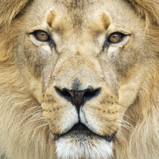
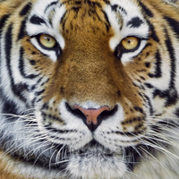
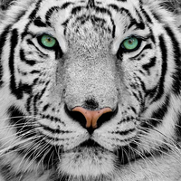
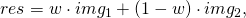
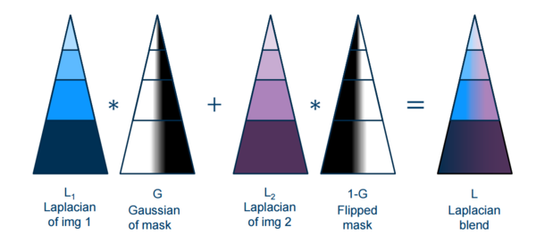
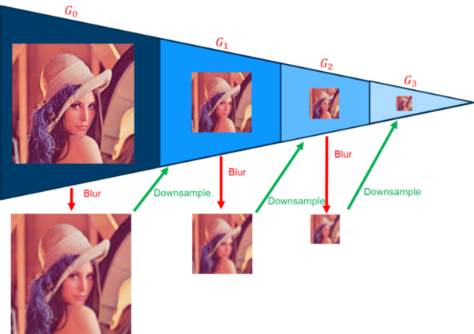
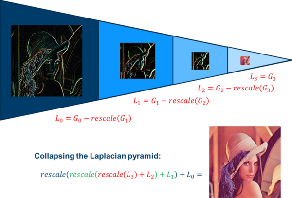

# Step 2: Implement image blending
Lets do some image processing!

## 1. Load and convert the source images
First, we need to read the two images we want to blend. 
We will start at the beginning of `lab2()` in [*lab_2.cpp:12*](https://github.com/tek5030/lab_02/blob/master/lab_2.cpp#L12).

- Read two images (choose two of the images given in the project directory)
  - Hint: [cv::imread(...)](https://docs.opencv.org/4.0.1/d4/da8/group__imgcodecs.html#ga288b8b3da0892bd651fce07b3bbd3a56)
  
- Convert the images to `CV_32F` and scale the pixel values so that they will lie in the interval [0, 1]
  - Hint: [cv::Mat::convertTo()](https://docs.opencv.org/4.0.1/d3/d63/classcv_1_1Mat.html#adf88c60c5b4980e05bb556080916978b)

&nbsp;&nbsp;&nbsp;&nbsp;

## 2. Create an image with weights for blending
Now we need to define how the two images should be blended together.
We will do this by constructing a weight image with weights

![w(u, v) \in [0, 1].](math_weights.png) 

A weight of 1 means that the blended pixel will be equal to the corresponding pixel in image 1, while a weight of 0.5 means that the resulting pixel is an equally large mix of both images.

Go to [*lab_2.cpp:25*](https://github.com/tek5030/lab_02/blob/master/lab_2.cpp#L25)
- Create the weight image:
  - The size is equal to the size of the input images
  - It should have 3 channels given in 32-bit floating point
  - The left half of the image should be black (pixel value 0.0 in all channels)
  - The right half of the image should be white (pixel value 1.0 in all channels)
  - Hints: [cv::Mat](https://docs.opencv.org/4.0.1/d3/d63/classcv_1_1Mat.html#details), [cv::colRange()](https://docs.opencv.org/4.0.1/d3/d63/classcv_1_1Mat.html#aadc8f9210fe4dec50513746c246fa8d9)
- Make a ramp (a smooth gradient) in the transition between black and white
  - Hint: [cv::blur](https://docs.opencv.org/4.0.1/d4/d86/group__imgproc__filter.html#ga8c45db9afe636703801b0b2e440fce37)
  

  
## 3. Simple linear blending
The next step is to implement functionality for simple linear blending, where the two images are mixed according to the weight image.

First, take a look at the function declarations and documentation in [*linear_blending.h*](https://github.com/tek5030/lab_02/blob/master/laplace_blending.h).

Then, go to `linearBlending()`  in [*linear_blending.cpp:3*](https://github.com/tek5030/lab_02/blob/master/linear_blending.cpp#L3).

- Implement linear blending of two images using the weights,
  
  
  
  and return the result. 
  
  Tip: You can solve this step using only image operations, without writing any loops. 
  Read about the [cv::MatExpr](https://docs.opencv.org/4.0.1/d1/d10/classcv_1_1MatExpr.html#details) class.
  
- Run the code and check that the result looks reasonable.
- Try changing the ramp size `ramp_width`. What happens?
- Try making the blend as smooth and visually pleasing as possible.

## 4. Laplace blending
To demonstrate the difference between simple linear blending, and scale-aware blending, we will now implement and test Laplace blending.
We will even get to play around with scale pyramids!

Recall from the lecture that Laplace blending performs linear blending at different stages in the laplacian pyramid for an image (at different scales):



First we convert the image to a laplacian pyramid, then we perform the linear blending, and finally we reconstruct the blended laplacian into the resulting blended image.

Take a look at the function declarations and documentation in [*laplace_blending.h*](https://github.com/tek5030/lab_02/blob/master/laplace_blending.h).

Then, go to [*laplace_blending.cpp*](https://github.com/tek5030/lab_02/blob/master/laplace_blending.cpp).

- Construct a Gaussian pyramid
  - Finish [constructGaussianPyramid()](https://github.com/tek5030/lab_02/blob/master/laplace_blending.cpp#L27)
  - Hint: Use [cv::pyrDown()](https://docs.opencv.org/4.0.1/d4/d86/group__imgproc__filter.html#gaf9bba239dfca11654cb7f50f889fc2ff)

  
  
- Construct a Laplacian pyramid
  - Finish [constructLaplacianPyramid()](https://github.com/tek5030/lab_02/blob/master/laplace_blending.cpp#L46)
  - Hint: Use [cv::pyrUp()](https://docs.opencv.org/4.0.1/d4/d86/group__imgproc__filter.html#gada75b59bdaaca411ed6fee10085eb784)
  
  

- In [laplaceBlending()](https://github.com/tek5030/lab_02/blob/master/laplace_blending.cpp#L20), blend the images using `linearBlending()` on each pyramid level.

- Reconstruct the blended image by collapsing the Laplacian pyramid
  - Finish [collapsePyramid()](https://github.com/tek5030/lab_02/blob/master/laplace_blending.cpp#L54)
  - Hint: Use [cv::pyrUp()](https://docs.opencv.org/4.0.1/d4/d86/group__imgproc__filter.html#gada75b59bdaaca411ed6fee10085eb784)
  
  
  
- Compile and run the program. Check that the results look reasonable.
- Compare the results with linear blending.
- What happens when you reduce the ramp size down to a very steep gradient?

 ## 5. More fun!
 Try other images
 - Capture images using the camera
 - Download images from the internet
 
 Try other weight masks
 - Circles
 - Other shapes
 
 Do co-registration of images
 - Select points in the first image, with corresponding points in the second image, for example eyes, nose and chin.
 - Warp the second image to fit the first.
 - Blend.
 
 You can use the code below as inspiration to perform the warp.
 
 ```c++
cv::Point2f pts_1[] = {{321, 200}, {647, 200}, {476, 509}};
cv::Point2f pts_2[] = {{441, 726}, {780, 711}, {615, 1142}};
cv::Mat trans_mat = cv::getAffineTransform(pts_2, pts_1);
cv::warpAffine(img_2, img2, trans_mat, img_1.size());
```
 
